# Primus Inter Pares 2026 — Architektura Systemu

## 1. Architektura ogólna
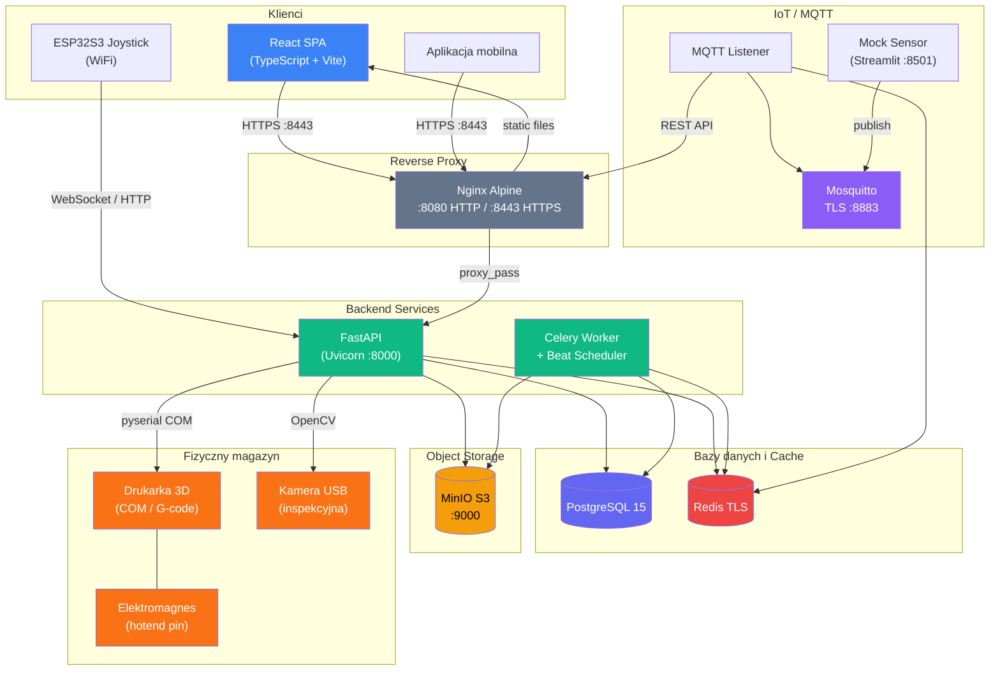

---

## 2. Repozytoria projektu
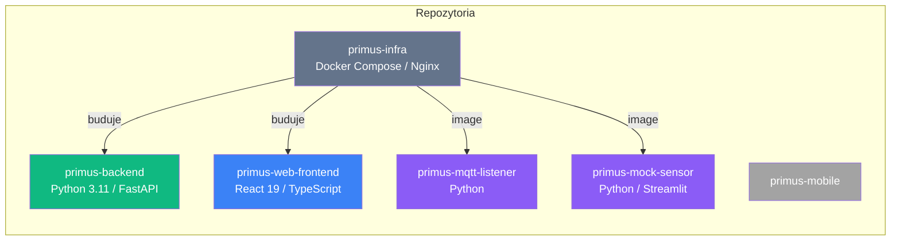

---

## 3. Stos technologiczny

### 3.1 Backend
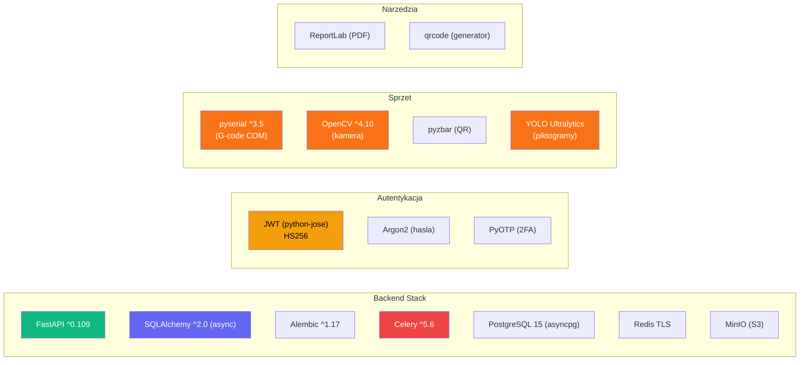

### 3.2 Frontend
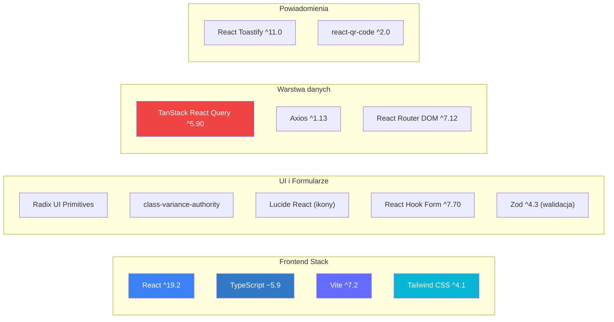

---

## 4. Serwisy Docker Compose
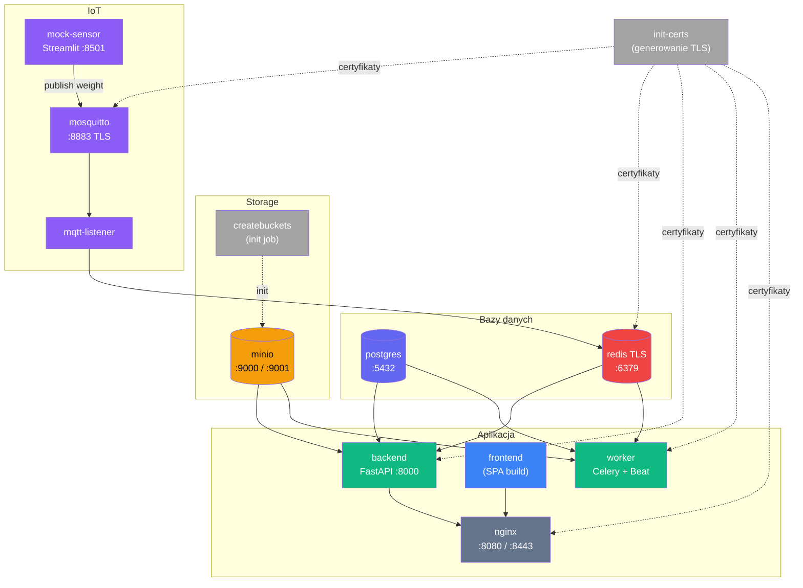

---

## 5. Bezpieczeństwo
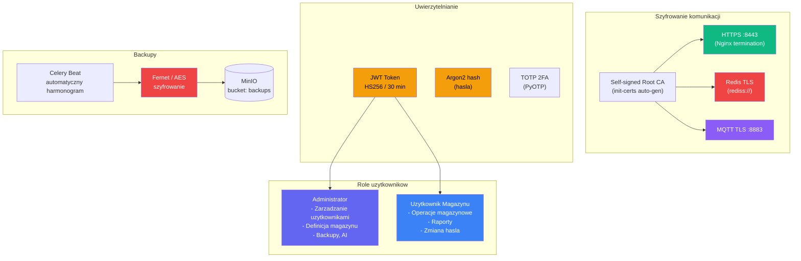

---

## 6. Integracja sprzetowa (ETAP FINALOWY)
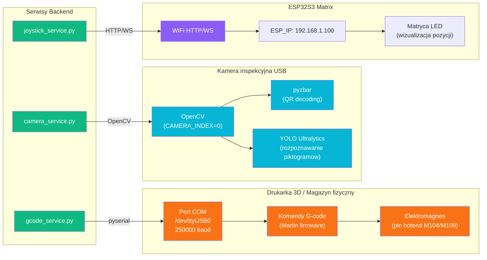

---

## 7. Przyjecie towaru (Inbound)
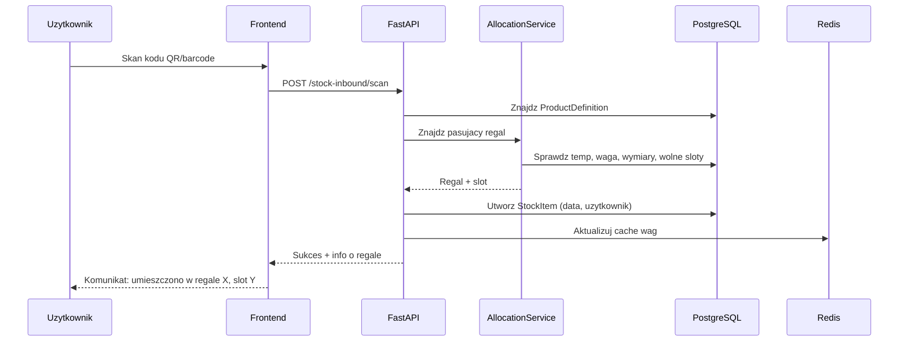

---

## 8. Wydanie towaru (Outbound FIFO)
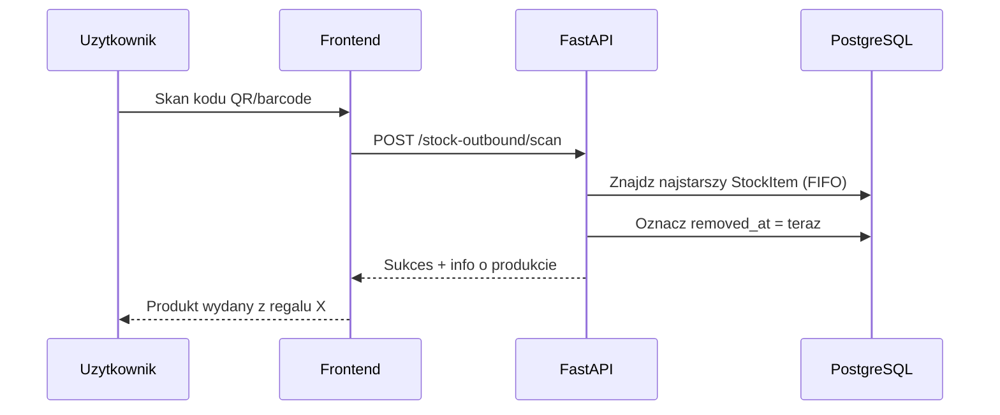

---

## 9. Fizyczny Pick and Place
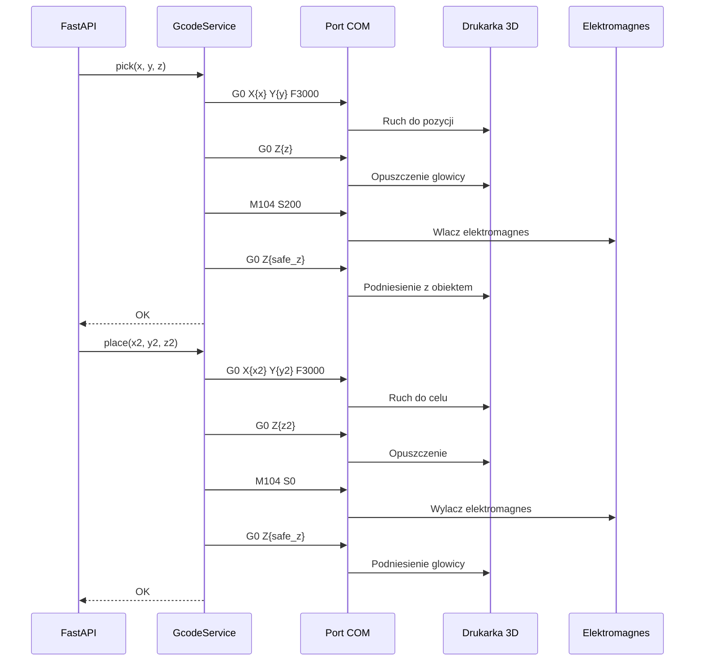

---

## 10. Flow monitorowania (IoT)
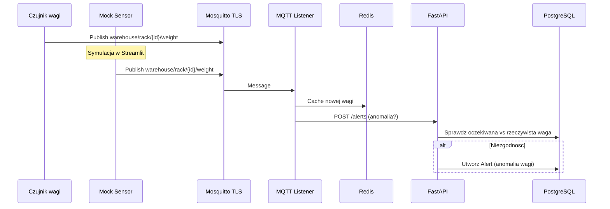

---

## 11. Warstwa danych (ERD)
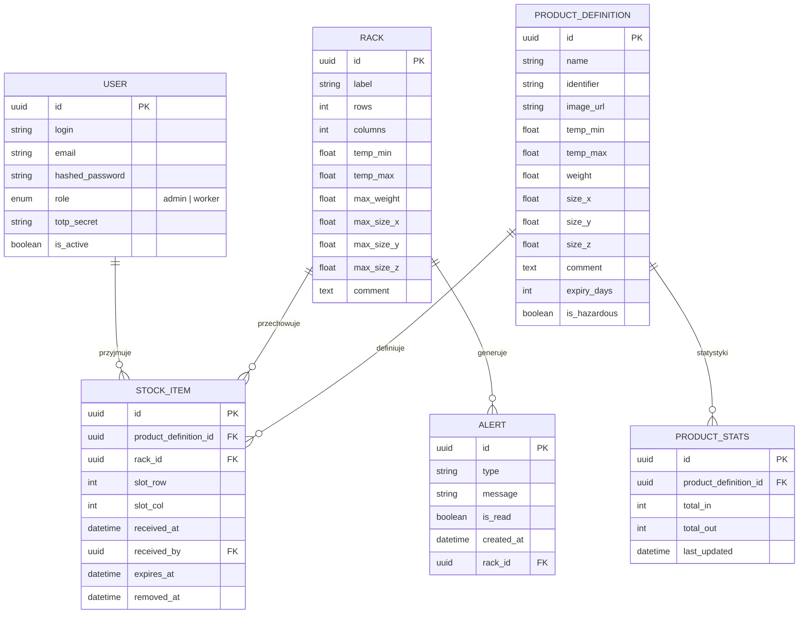

---

## 12. Zadania asynchroniczne (Celery)
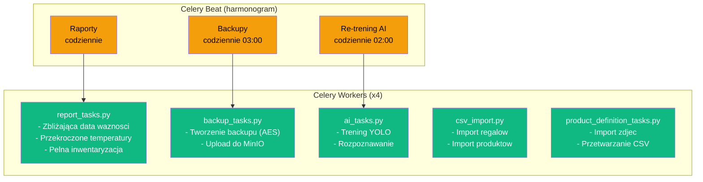

---

## 13. Mapowanie zadan finalowych
```mermaid
graph LR
    subgraph Etap2["Etap 2 - Aplikacja magazynowa"]
        E2_1["Definiowanie regalow"]
        E2_2["Definiowanie asortymentu"]
        E2_3["Przyjmowanie / Wydawanie"]
        E2_4["Monitorowanie"]
        E2_5["Wizualizacja"]
        E2_6["Raporty"]
        E2_7["Backupy"]
        E2_8["Uzytkownicy i Role"]
        E2_9["AI Rozpoznawanie"]
        E2_10["Asystent glosowy"]
    end

    subgraph Etap3["Etap 3 FINAL - Magazyn fizyczny"]
        E3_1["Sterowanie USB G-code"]
        E3_2["Bezpieczny obszar pracy"]
        E3_3["Szachy QR"]
        E3_4["Szachy piktogramy"]
        E3_5["Inwentaryzacja auto"]
        E3_6["Skladowanie na sobie"]
        E3_7["Optymalizacja FIFO"]
        E3_8["Kolko i krzyzyk"]
        E3_9["Generator QR"]
        E3_10["Logo OZT"]
        E3_11["Joystick programowy"]
        E3_12["Joystick ESP32"]
    end

    style E2_1 fill:#10b981,color:#fff;
    style E2_2 fill:#10b981,color:#fff;
    style E2_3 fill:#10b981,color:#fff;
    style E2_4 fill:#10b981,color:#fff;
    style E2_5 fill:#10b981,color:#fff;
    style E2_6 fill:#10b981,color:#fff;
    style E2_7 fill:#10b981,color:#fff;
    style E2_8 fill:#10b981,color:#fff;
    style E2_9 fill:#10b981,color:#fff;
    style E2_10 fill:#10b981,color:#fff;
    style E3_1 fill:#3b82f6,color:#fff;
    style E3_2 fill:#3b82f6,color:#fff;
    style E3_3 fill:#3b82f6,color:#fff;
    style E3_4 fill:#3b82f6,color:#fff;
    style E3_5 fill:#3b82f6,color:#fff;
    style E3_6 fill:#3b82f6,color:#fff;
    style E3_7 fill:#3b82f6,color:#fff;
    style E3_8 fill:#3b82f6,color:#fff;
    style E3_9 fill:#3b82f6,color:#fff;
    style E3_10 fill:#3b82f6,color:#fff;
    style E3_11 fill:#3b82f6,color:#fff;
    style E3_12 fill:#3b82f6,color:#fff;
```
